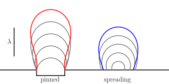

# Bubble & Pendant Drop Interface Calculator

[](https://doi.org/10.1039/D6FD00113K)
[](https://arxiv.org/abs/2609.24342) 
[](https://doi.org/10.5281/zenodo.20720640)



Calculate **interface shapes, volumes, and detachment thresholds** for fluid bubbles and pendant drops on flat surfaces.

This toolkit solves the **Young–Laplace equation** using the **Adams–Bashforth integration method** across a range of wetting states, including pinned and spreading/moving contact lines. The results are validated against classical experimental datasets from the literature.

The method and results are described in:

> I. Cannon, S. C. Endres, L. Mädler, and M. Avila,
> *Bubble detachment from circular cavities and flat surfaces*,
> **Faraday Discussions** (2026).
> https://doi.org/10.1039/D6FD00113K

## Requirements

* GCC
* Python 3
* NumPy
* Matplotlib
* LaTeX

## How to Run

Compile the C program:

```bash
gcc -O2 -o run bubble.c -lm
```

Run the calculator:

```bash
./run
```

Install the required Python packages:

```bash
pip install numpy matplotlib
```

Generate the plots:

```bash
python plot.py
```
